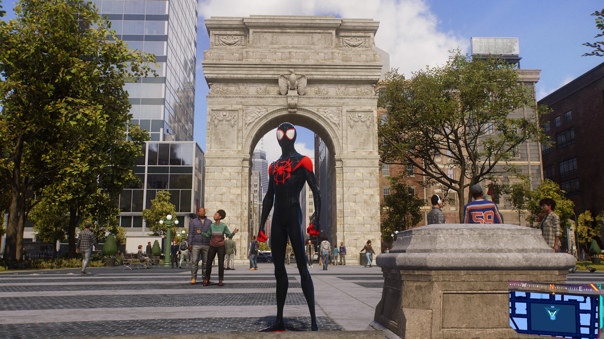
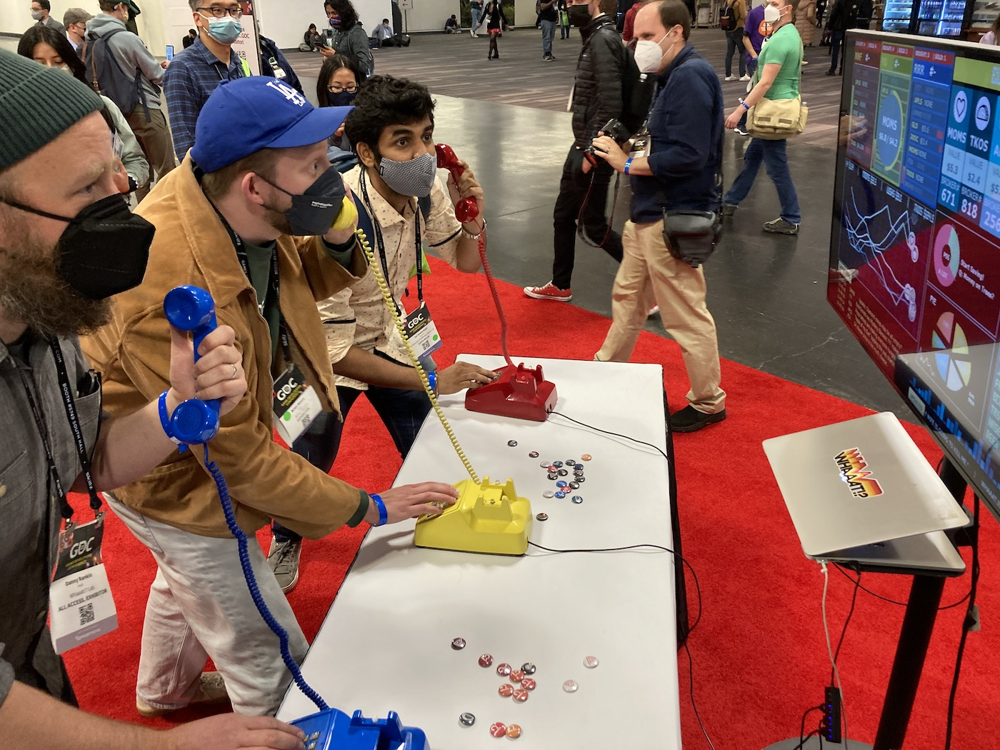
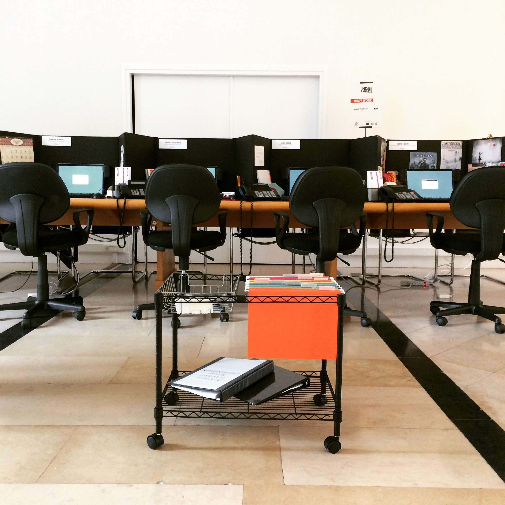
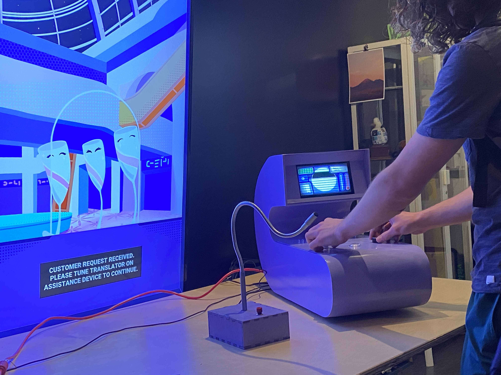
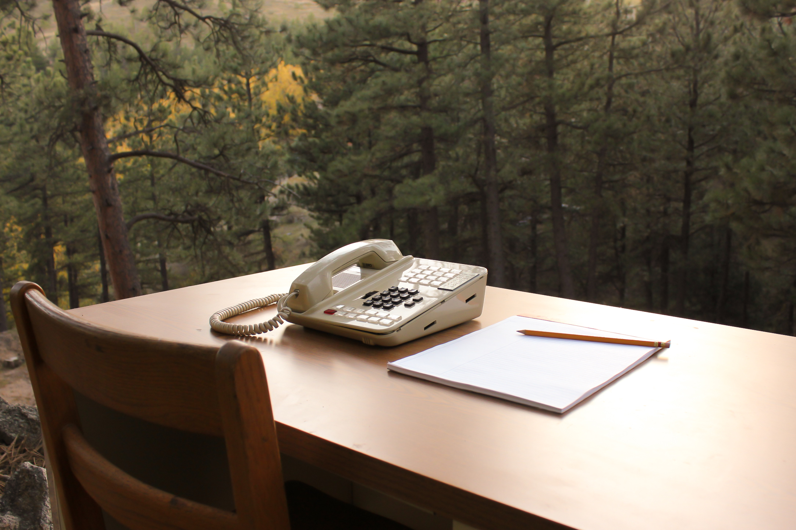
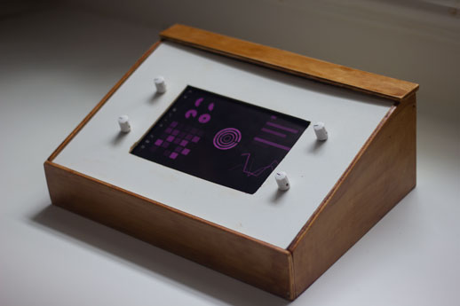
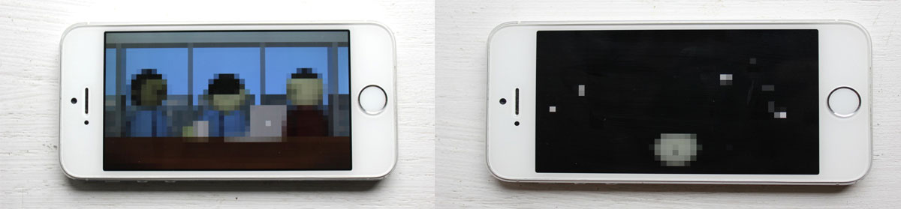

# A Decent Proposal

_notes: ~9000 words (without references)_

## Introduction

Contemplative play offers a way of engagement that is both reflective and participatory - an approach to dwell with and on the world and its inhabitants in a playful manner. The aesthetic lenses of Players, Playthings, Playgrounds, and Playtime provide a framework to analyze the various ways and environments that make play 'contemplative.' In addition, other artistic practices that encourage a contemplative engagement with the world—such as soundwalks, deep listening, performative objects, contemplative architecture, and ambient media—enhance our understanding of contemplation as distinct from religious experiences. Through a reflective design practice - making playful experiments in response to each of these ==four aesthetic frameworks== %% lenses? viewpoints? elements? [P: If they come from Adorno, what does he call them?]%%, reflecting on the nature of play experienced through these explorations, and leveraging the method for design materialization (MDM) for more profound insights  - we will gain more crystallized knowledge about that potential, and develop ways to cultivate more engaging and meaningful play experiences. %% addressed your comments in here, but I'm still not sure about starting with this. Feels weird/businessy to me? Like I'm trying to sell some snake oil. My natural inclination is to start with the problem and then present a solution. However, also, it's just for the proposal, so I can see getting right to the point. [P: Yeah I'm inclined to agree when I see it. I think it can maybe be a mix though. See my note at the end of the intro for a swapping proposal. ] %%

Contemporary society has created a situation in which people feel overwhelmed, with fractured attention and the pressure to be continually active and productive. Jenny O'Dell is a key voice in this movement %% [P: What movement?] %%, publishing books such as *How to do Nothing* %% cite %% and *Saving Time* %% cite %%, but many others have noted the pull to have a more meaningful relationship with the world than what the design of our technologies seems to dictate. We act and act, without giving ourselves time to reflect, to contemplate the nature of the world. In the past, art  fulfilled this purpose. The paintings in our museums, the music in our recital halls, and the stories in our literature would give us opportunities for contemplation, but now even our leisure time is full of activity and over-stimulation. Philosopher Byung-Chul Han laments this loss of respite, saying "'Leisure time' lacks both intensity of life and contemplation. It is a time that we kill so as not to get bored. It is not *free, living time*; it is *dead time*." %% cite %% In contrast, he claims "we owe true happiness to the useless and purposeless, to what is intentionally convoluted, what is unproductive, indirect, exuberant, superfluous, to beautiful forms and gestures that have no use and serve no purpose." %% cite %% He names this concept "ceremonious inactivity" where "we do something, but to no end,' resulting in the discovery of a reality that "reveals itself only to contemplative attention." %% cite %%

Play is an ideal vehicle for this 'ceremonious inactivity.' It is a powerful, engaging, and increasingly common way to engage with the world around us. For decades, game designers and researchers have claimed that play provides an opportunity to understand fundamental aspects of human existence. Bernie De Koven, a foundational figure in this movement, speaks to how play can elicit "a shared transcendence of personal limitations, of our understanding of our capabilities; a sudden, momentary transformation of our awareness of the connections between ourselves, each other, and the world we find each other in." %% cite %% Similarly, in his book *Play Matters*, Miguel Sicart states that "[t]o play is to be in the world. Playing is a form of understanding what surrounds us and who we are, and a way of engaging with others. Play is a mode of being human." %% cite %% Designer/researcher Frank Lantz argues that the very nature of play as being outside normal life contributes to its aesthetic value: "It is this distance that gives aesthetic experiences their power to be *about* life, its purpose and values." %% cite %% Play is a lens that shows us truth in the world, %% [P: I see the linking intent with the next bit, but not sure it's needed] %% ==and deeper still, there are facets or angles within that lens that we can use to examine particular aesthetic aspects of play.==

Aesthetic theory provides a helpful framework with which to analyze the experience of play. In his book *Design Aesthetics,* Mads Nygaard Folkmann states that "aesthetics gives way for a reflection of how we perceive, sense, and are present in the world – that is, how we relate to our surroundings." %% cite %% Common understanding of aesthetics can be slippery, with definitions stretching back to Plato and Kant and covering concepts such as phenomenology, art-for-art's-sake, and epistemology. However, taking from Yuriko Saito's concept of 'everyday aesthetics', which encompasses "the sensuous and/or design qualities of any object, phenomenon, or activity," %% cite %% we can better develop a functional scaffold with which to approach the design and analysis of both play and contemplative experience. With this understanding in mind, I propose four distinct components of play: Player(s), Playthings, Playgrounds, and Playtime. %% [P: No longer Adorno? Maybe state this is explicitly drawing from your own work, case studies of your work generates the categories it's worth talking about] %%

Using play as a 'ceremonious inactivity,' we can focus on an aesthetic of 'contemplative play,' a play with the potential to more clearly show the nature of the world around us, and who we are within that world. The functionality of play, the nimble maneuvering of people together within a system, is a unique form of meaning-making that, in an age of fractured attention and instrumentalized leisure, offers a compelling alternative: a space of purposeless engagement where we encounter ourselves, others, and the world afresh. Where many games try to guide the player through specified challenges and defined narratives, contemplative play points the player toward an openness that provides the opportunity for introspection at a deeper, more ambiguous level. %% [P: This is the para I would put at the top, with some "in this thesis" bits, but keeping the gentle and more general spirit here. I'd then move the top para down here, maybe loosen it up a teeny bit, using it to establish the nuts and bolts of the proposed research step by step - which is pretty much what it's doing up there, but it'll be more welcome down here I think tonally] %%

## Literature Review

### Reflective Design

In his 1982 book *The Reflective Practitioner*, Donald Schön sets up his argument for "reflection-in-action," %% cite %% a way of thinking about design practice that has been adopted by academics and practitioners alike (Frayling, Redström, Eklund et. al, etc) %% cite %%. Though this design process-focused understanding of "reflective practice" is perhaps most commonly discussed with a focus on the designers themselves, we can also think about how as designers we can build "reflective practices" in to our designs. %% [P: Oh that's quite nice. Did I miss this previously? Seems like an intriguing avenue to follow, has anyone done this before? ] %%
  
The concept of reflection has found a strong foothold in the academic world, where it becomes a desired state for learners. Numerous thinkers and educators have relied on Dewey's concept of 'reflective thought' as a goal for teaching. %% cite %% Dewey explains this state as "active, persistent, and careful consideration of any belief or supposed form of knowledge." %% cite %% Dewey and those who follow focus on how reflection helps the learner learn. For them, the goal is the gaining of knowledge. Jennifer Moon, for instance, states that reflection is "a mental process of thinking about what we have done, learned, and experienced." %% cite %% This understanding of reflection is unambiguous and practical, something to be harnessed for a desired end outcome.  
  
Similarly, in their paper "Reflective Design," Phoebe Sengers et al., %% cite %% build on critical theory to argue for designs that brings "unconscious aspects of experience to conscious awareness, thereby making them available for conscious choice." %% cite %% Specifically, they "expand on reflection-in-action by not waiting for surprise to occur but by intervening to create or stimulate these reflection triggers." %% cite %% This shifts the focus of reflection away from the nature of the designed object and instead places it on the nature of technology as a whole. Sengers et al. argue that by focusing on the user's critical reflection, designers are able to counter norms and create positive social effect.

However, there is also an opportunity for designing more ambiguous reflective experiences. One possibility is through experimental interactions. Lars Hallnäs and Johan Redström's %% cite %% "Slow Technology - Designing For Reflection" introduces the concept of "slow technology \[...] as a tool for making reflection inherent in design expression." %% cite %% They propose that slowing down, removing clarity, and building friction into designs can make the user reflect on the nature and role of technology in their life. A doorbell that influences several fans behind an array of fabric squares communicates something different from the usual chime, but what exactly? The user is left to consider these objects and interactions and what they might mean. This is similar to Rilla Khaled's proposal of a 'reflective game design,' where the designer designs to highlight questions over answers, disruption over comfort, and reflection over immersion. %% cite [ P: And, again, I'd expand this given Rilla's on the committee ] %%

### Contemplative Design
  
In order to differentiate the present work from the widespread use of "reflective design" as a means for targeted critical reflection, I propose the term *contemplative design*. Although often used in relation to spiritual practice (the writings of Thomas Merton being the most obvious example %% cite [P: and expand I'd say, otherwise you leave the reader feeling like they don't know something obvious - I don't know Merton! ] %%), "contemplation" gets more to the root of what a deep interaction with designed experiences could feel like. In their paper "Contemplative Neuroaesthetics and Architecture: A Sensorimotor Exploration," Djebbara et al. %% cite %% use the term to indicate "heightened level of awareness and an intentional focus on the present moment, fostering a state of deep reflection and non-judgmental engagement." %% cite %% Using examples from architecture, including the Rundetårn in Copenhagen, Denmark, Louis Kahn's Salk Institue in La Jolla, California, and the Chartres Cathedral in France, Djebbara et al. argue that these buildings can bring about states of deep contemplation/reflection in a viewer. %% [ P: Does this feel a little incomplete? Are you convinced by the argument? What is the nature of their argument? ] %%

We see this focus on contemplative design in other places as well. Such designs are often art objects, with critical design and speculative design as example approaches. Anthony Dunne's Faraday Chair, for example, uses a large Faraday cage to create a haven from electromagnetic fields, which causes the viewer to ask, "If the inside is empty, what is outside?" %% cite %%(Interestingly, the "chair" is actually a daybed. Faraday claims that "once electromagnetic fields are taken into consideration, conventional assumptions about everyday objects need to be reexamined.") %% [ P: Feels like a slightly strange and overlong parenthetical, perhaps it should be main text  given that you're helping to explain how the contemplative/critical thing actually works here? ] %%. In Critical Play, Mary Flanagan calls these the designs that "represent one or more questions about aspects of human life." %% cite [ P: And expand to explain what Flanagan means? ] %% 

Soundwalking is another field of practice that can significantly inform this concept of contemplative design. %% [ P: Or is it in itself an *instance* of contemplative design? ] %% Soundwalking started as part of R. Murray Schafer's *World Soundscape Project*, %% cite %% which arose from active listening practices developed by artists like John Cage and Pauline Oliveros. %% cite %% Schafer and those in the project sought to anchor these active listening practices to a given place. Hildegard Westerkamp especially believed that through soundwalking, listeners could better understand their sonic environments. %% cite %%
  
Janet Cardiff and George Bures Miller use their recorded soundwalks to guide the listener through a world of their making, a sonic world that is overlaid onto a real, physical place. %% cite [ P: And perhaps namecheck a piece so that you can be more concrete in connection with it ] %% Snippets of conversation slip by that feel like they are in the same space as you. Cardiff speaks directly to you but then has a conversation with others who are not visibly present. Recorded audio effects of long-gone marching bands, sirens, and political rallies make the listener feel like they are experiencing a highly professional radio drama, creating a space for deep and truly unique contemplative experiences. %% [ P: Might you get push-back on whether or why this leads to contemplation? Currently this is more an assertion... ] %%

Kristina Niedderer's "performative objects" are another noteworthy example. %% cite %% She distinguishes these objects from Jacques Carelman's _Catalogue d'Objets Introuvables_ %% cite %% by describing them as, "objects that can cause mindfulness in the context of everyday use, and not in the institutional context of art." %% cite %% This separation means that the performative object must rely on adaptations within its formal elements to create a contemplative state *while remaining functional.* This is particularly interesting as we consider designing contemplative experiences for game-like experiments that retain their sense of play. %% [ P: I like the thing here of specifically identifying something you'll want to return to, worth keeping an eye out for which other theorists contribute something like this and consider whether it ought to be highlighted further structurally ] %%

Another reference point for contemplative design is "ambient interactive experiences." %% cite [ P: I assume there's a citation here? They should probably be namechecked if so ] %% These designs build on ideas from other slow, ambient media such as the music of Brian Eno %% e.g. %% and the films of Godfrey Reggio %% e.g. %% to create a different %% [ P: Is there a more specific word than "different"? ] %% kind of experience than traditional play. The field of slow games is compelling and a clear precedent (with Liam Gibbons's %% cite 2020 %% thesis "Strategies for the Design of Reflective Shortform Videogames" being especially instructive as I work on these ideas %% [ P: A little to insider-y for this text? ] %%), but thinking about ambient media opens up the opportunity to include a lot more material. These projects are interested in slow pacing, obfuscation, and less "comfortable" experiences, with varying degrees of success. Examples include the work of David O'Reilly %% cite %% and Pippin Barr's v r 5 %% cite %%, among others.
  
### Aesthetics of Contemplative Play
  
Book III of Schopenhauer's %% cite %% "The World as Will and Representation" holds some interesting %% [ P: I'm personally a bit allergic to "interesting" in writing like this, maybe "key" or something? ] %% language about what he calls "aesthetic contemplation," which is pertinent to the ideas of contemplation in artistic fields. In section 34, he describes the shift from looking at something through "reason" to "a steady contemplation" by saying:  
  
> if, instead of all this, we devote the entire power of our mind to intuition and immerse ourselves in this entirely, letting the whole of consciousness be filled with peaceful contemplation of the natural object that is directly present, a landscape, a tree, a cliff, a building, or whatever it might be, and, according to a suggestive figure of speech, we *lose* ourselves in this object completely, i.e we forget our individuality, our will, and continue to exist only as pure subject, the clear mirror of the object  

%% cite %%
  
This concept of aesthetic contemplation helps to specify the type of experience that one could have with the built environment, an experience that moves from the surface to something deeper. What is especially helpful is how Schopenhauer includes space for *active* contemplation on the viewer's part. It is not a passive, peaceful, zen calm, but rather an attitude of looking that is searching for more. Some philosophers and art historians have coined the term ["aesthetic attitude"](https://iep.utm.edu/aesthetic-attitude/) to explain this idea. %% cite %%
  
By thinking of the "aesthetics of play" we can create a series of lenses with which to explore the idea of contemplation. I find that Katja Kwastek's %% cite %% _Aesthetics of Interaction in Digital Art_ is foundation here (and even includes a chapter on the "Aesthetics of Play"), and there are numerous existing frameworks for thinking about the elements of play (Salen and Zimmerman, Fullerton, Anthropy and Clark, Hunicke et al., and Schell are all good examples) %% cite [ P: And conceivably if you have the energy expand one or more of them to reject/cherry-pick elements that are relevant to contemplative play? ] %%. My goal, however, is to be descriptive %% [ P: Exploratory, maybe? ] %% rather prescriptive, merely %% [ P: Probably playing down too much with "merely" ] %% using some of the "things of games" %% [ P: Is this a quote? It's very vague...] %% to help organize the exploration. I propose simplifying down these to four main aesthetic elements: playgrounds, playthings, playtime, and players. %% [ P: Wasn't this coming from Adorno? Somewhere? Cite? ] %%

## Methodology

This research relies on game experiments to explore the possibilities in manipulating playful aesthetics towards contemplative ends. These playful experiments will be tangibile outputs to test ideas %% [ P: Is "explore" a better word? ] %%  found in the overlap between playful aesthetics and contemplative design, with knowledge arising both from the active building of these experiments as well as in conversation with other designers. Each of these prototypes will go through a series of stages. The overall trajectory for this exploration will resemble the classic design process, with stages of divergence and convergence throughout. As in the traditional interactive design process, each stage of the process is evaluated in stasis by me and in conversation with design peers. These conversations will lead to new insights and feed into future iterations of the overall concepts. %% [ P: Hmm. It's quite stiff. I'll think further. ] %%

Throughout this exploration, I will initially use an internal iterative design process as a basis from which to pursue and evaluate my designs. This is in alignment with ideas stemming from traditional iterative design practice where designers rapidly develop and test many ideas on an individual level, discarding anything that obviously doesn’t work, and refining all of the ideas down to a few testable prototypes. %% Cite something %%  This method also relies on the design through research practices as proposed by Frayling and Redström, in which knowledge is gained through the practice of design. %% cite %%

Additionally, I will gain knowledge about my solution through observation and conversations with other designers. Sharing work with other designers who have deep experience in a discipline is a great way to catch these early mistaken assumptions that I might be making about my audience, goals, and proposed solutions. %% [P: Probably needs to be deeper and more grounded to sound like it properly belongs in a PhD, which I believe it does.] %%

### Foundations: Research Through Design, Design Practice, and Practice-Based Research

In his paper for the first issue of Research in Art and Design, Christopher Frayling introduced his ideas for the relationship between research and design. %% cite %% He distinguished between research into art and design (where the research is historical, cultural or theoretical), research through art and design (where the research is into the processes and tools for future design methodologies), and research for art and design (where the end product is an artifact). In the years following, many researchers adapted these ideas, and the area that Frayling labeled as research for art and design has become more widely understood as research through design.

In their introduction to Perspectives on Design Research, Bærenholdt et al. %% cite %% refer to this mode as both research through design and design-based research (including design through research) noting that, “design becomes as much a medium and process of research, as a result.” %% cite %% It is through the making of designs that knowledge is gained, but how we exactly understand this relationship can be more complex.

The specific framework that I employ to understand how my research and designs are in conversation is firmly situated in Johann Redström’s tactic of Sequencing.%% cite %% Redström expands on Frayling’s concept of research through design and explores explicit tactics for how these methods are employed. His concept of sequencing, where design and theories are meant to coexist throughout the process, is of particular interest. “Using a highly iterative process, more developed relations between theory and design can evolve as the understanding of how the different design variables will have an impact on the test situation grows deeper.” %% cite %%

~~I believe that t~~ The iterative design process is uniquely suited and positioned to benefit from this concept of sequencing. As a designer, it is fundamental that you document and reflect on your designs and how they are being perceived by a given audience. In this way, you are in constant conversation with the design, testing its validity, and gaining knowledge in the process. %% [P: Very Schön-y too] %%

This understanding of the benefits of the design process is echoed in the concepts of practice-based research. Linda Candy, in the Routledge International Handbook of Practice-Based Research, defines practice-based research as “a principled approach to research by means of practice, in which the research and the practice operate as interdependent and complementary processes leading to new and original forms of knowledge.” %% cite %% An important concept here is that it is through the creations of these designed artifacts that the researcher is able to test and gain knowledge about the world.
  
### Internal Iterative Game Design Process with the Method for Design Materialization

The initial stages for this research will rely on my practice as a game and sound designer. It is here where the most radical idea generation, prototyping, reflection, and refinement will happen.

In *The Reflective Practitioner*, Donald Schön argues that “research is an activity of practitioners. It is triggered by features of the practice situation, undertaken on the spot, and immediately linked to action.” %% cite %% I have found that this very accurately describes my own game design process. As a designer, I am in a dialog with my design, and the process involves thousands of decisions that are repeatedly implemented and evaluated, with this interchange happening throughout the entirety of the process.

In my practice, this process starts with a sketching phase. %% cite Buxton? %% Ideas about visual style, game mechanics, themes, etc are explored by rapidly sketching and reflecting on their feasibility and design potential. The goal of this stage is to generate as many ideas as possible, helping me think through the problem and generate possible solutions. These ideas are then refined down to something more concrete and actionable that I intend to build and test in the digital space. The collateral from these sessions are captured using a camera to be included in any online documentation.

Once the design process moves into the digital space, I use the game engine Unity, image creation software Photoshop, and digital audio workstations (DAWs) like Reaper and Ableton Live in conjunction to build prototypes that implement some of the most promising ideas from the ideation phase. As these prototypes are built, new ideas emerge and those that do not work as intended are discarded. %% Maybe explicitly point out the conversation with materials taking place here %% This refinement happens repeatedly and at a very quick pace. Then, once the ideas are more solidly understood, the process of refinement introduces even quicker but far less radical incremental changes. This stage adheres to Jesse Schell’s Rule of the Loop, where “the more times you test and improve your design, the better your game will be.” %% cite %%

Through all of these phases, I implement the Method for Design Materialization (MDM) first presented by Rilla Khaled, Jonathan Lessard, and Pippin Barr %% cite %% in “Documenting Trajectories in Design Space: a Methodology for Applied Game Design Research.” In this method, the small decisions that a designer makes during the course of their process are documented using the version control system Git %% [ P: GitHub is just the cloud storage platform in the end really ] %%. Any time that the designer uploads a commit, they write a detailed message commenting on the particular design decision, motivations, thoughts, and any future plans at that specific moment in time %% [ P: And sticking with Schön, reflections of conversations with material, relationship to technical practice to design ] %%. This then becomes part of the overall archiving not only of a design’s trajectory, but also the designer’s unique thought process. Khaled et al. %% cite %% state that the “history of commits over time can give an understanding of the overall design space and how it has been traversed: its pressure points, its branching points, where decisions have been made, and where possible lines of inquiry have been pruned.” %% cite %% The most important thing about this is that the large amount of qualitative data produced makes it possible to use methods of analysis derived from grounded theory %% [ P: and thematic analysis, and CITE ] %% to organize, analyze, and develop theories about the information that is generated. From this analysis, patterns can emerge to aid in reflection on the solutions and suggest new possible directions for exploration. %% [ P: Going to want to expand on the analysis component here and get explicit about the procedures. ] %%

The end goal of all of this should be a playable prototype that has made it through several phases of internal testing and refinement and is ready to be shown to others. %% [P: Really, though, as per the above, the end goal is a prototype *and the archive of design documentation*] %% Generally, I rely on my network of trusted colleagues and friends for feedback on the work that I am making. These are other game and/or sound designers and those whose opinion I can rely on to give me valuable feedback. This sharing of work often sparks a dialogue that helps me refine both the thing that I am making as well as the entire thought around the conceptual side of the work. %% [P: Should probably think of a way to formalize this a teeny bit, there's probably some official methodological approach that describes this] %%

This entire phase of the process will take place within the framework of the MDM. All feedback will be documented and added to the project repository %% [P: Think this is the first mention of a repository? Need to check in on technical language and make sure it's always glossed on first use] %%. This way it can be included in the overall analysis of the design research. This synthesized information will then be applied to further iterations on both this particular design solution and future explorations. %% [P: I think you're saying that even the analysis process is in the repo? May needed to be clearer] %%

### Summary

In summary, my methodology for each iteration of this research will go through a series of phases. Firstly through rapid prototyping on an individual level, where my intuition %% [P: And experience and... probably want to sell yourself as experienced and already good at this] %% as a designer will help to refine an initially large amount of ideas to only those with the most potential. This design through research practice will facilitate knowledge creation both about ==the problem and these possible solutions== %% [P: Bit vague] %%. Additionally, I will leverage observations and conversations with other designers to test these designs, quickly implementing what is learned into a series of final playable prototypes that will arise from the study that I am undertaking in each of these aesthetic lenses. During the entirety of the design process, I will be using the method for design materialization to document, track, and analyze both my individual designs and the overall process to see what new knowledge can be gained and what new solutions might arise.

## Timetable

In general, I propose to focus on each of the four main aesthetic-topic areas for a set duration. During this focused time, I will read literature and experience first-hand the art and design experiences in this domain, responding to the material both in writing/reflecting and creating playful exploration prototypes. Once the initial stages have been complete, I will spend the remaining time on the synthesis and writing of the thesis paper.

* Explorations
    * Player (Sep. 2025 - Dec. 2025)
    * Playthings (Jan. 2026 - April 2026)
    * Playgrounds (May 2026 - August 2026)
    * Playtime (Sep. 2026 - Dec. 2026)
    * Synthesis, Thesis Writing, and Revisions (Jan. 2027 - Dec. 2027)
%% [P: Yep, fine by me. It's potentially the case you don't need the full year at the end, but why not right, and it's strategic at some level anyway, so all good.] %%
## Chapter Breakdown

My initial idea here is to have each of the main chapters focus on an aesthetic of contemplative play. Through each of these lenses, I will look at a specific artistic practice from outside the realm of games and then apply the lessons learned to a designed play experience. %% [P: Feels like this can obviously be more confident and together. Not clear you need a Part 1 and a Part 2, I think it can just be a series of chapters] %%

### Part 1
	- Introduction
	- Research Summary
	- Methodology
	- Contemplation, Reflection and Art

%% [P: The boring standard approach would just be Introduction, Background, Method; if you want to go down that road.] %%
### Part 2: Aesthetics in Contemplative Play

%% [P: It's not impossible you could be pinged a bit for these bits being a little on the short end. Feels like you probably already have so much more to say and project about the area + the project(s) you want to talk about.] %%
#### Player

Much of play is performative. A player acts out scenarios. They move their body in a coordinated effort with other players or the playful system. Play can even be designed so that the act of playing is engaging from those outside of the playspace. Professional sports is a clear example of this, but Let's Plays, E-Sports, and arcade experiences (kids gathered around a Street Fighter cabinet in the 90s or DDR machines in the early aughts) also point to the possibilities of "performing" play.

Soundwalking is an excellent genre precedent to think about how not only our physical bodies inhabit an experience, but also how the physical world around us allows for performance. Artists like Hildegard Westerkamp built on the active listening practices of Pauline Oliveros and John Cage to invite listeners to playfully explore acoustic space. Tapping on bridges, shouting in tunnels, banging on cans: these playful acts require the listener to become performer in order to discover something new about the world around them.

Thinking about the player as performer and how soundwalks (and other interactive artworks) have used the movement of participants to create meaning, what new contemplative and playful experiences can we create?

Games and Soundwalks both operate in this area of "performance," but come from at it at slightly different angles. The game "performance" is generally much more about how the avatar "performs" that the actual player. An early attempt to interweave soundwalks with play was a series of soundwalks for the PS5 game _Spiderman 2_, and while compelling for a variety of reasons, this concept of performance remains unexplored.

Installation-based play, Like Buy! Sell! thinks about the player as performer. In a similar way, playful soundwalks could be a space to explore the overlap between play and performative spaces. Janet Cardiff hints at these playful moments in her soundwalks, and future work (such as the "An Invitation to Play" soundwalk accepted to ICMC 2025 in Boston) will be a further exploration of these ideas.

#### Playspace

Space is a core aesthetic to the play experience. The concept of the magic circle in particular, sets to explain the physical, and mental demarcation between "the real" world and the imaginatively playful world. It is this established structure that gives the player agency to engage in playful acts, choosing one possible action over another and reflecting on how those actions contribute to the imagined world. 

Contemplative Architecture is similar in that the creation and consecration of a space can engender different perspectives than the ones a person came in with. Changes in sound, light, and material imbue the space with a meaning in contrast to the outside world. Huizinga's discussion of the "play-festival-rite" is of particular interest here, as it provides a direct link between play and contemplative (even sacred) spaces.

Focusing on this concept of the space in which play happens (i.e the magic circle) and examples from Contemplative Architecture, how can we create playfully contemplative experiences? Busy Work and TIKATMOS are two games that explore this question by creating distinct (and physical) gameworlds to facilitate a certain level of engaged play. 

Using narrative elements, physical actions, and environmental storytelling through the built environment, Busy Work examines the modern challenge of accomplishing work while juggling conflicting priorities. Players are left wondering if what they do matters, whether or not they are set up to fail and if the rewards are worth the effort. People handle the mundane and possibly futile aspects of life in many ways, and this work helps player to reflect on this by giving them playful options based on lived experience. 

TIKATMOS is a deeply speculative interactive installation that seeks to explore gaps in conversation, sustainability, the future of humanity, and what it means to help using voice-control technology and adaptive audio. By putting the player in the role of an unidentified species, and creating a fleshed-out world space, TIKATMOS pokes around some interesting questions about identity.

#### Playthings

The materiality of the objects in play has a profound effect on the playful experience. Not only do textures, shapes, and other physical characteristic communicate essential aspects of these items (which Fullerton dubs "resources"), but the very introduction of external elements themselves communicates something about the playful experience. A verbal bang, pointed finger, plastic cap-gun, and hyper-realistic 3D modeled firearm say something of the values at play in the games that include them, but the presence of weaponry at all as a "resource" communicates even more.

The Performative Objects of Kristina Niedderer fit well into this understanding, as they strategically explore the material and functional aspects of objects in order to provoke what she calls "mindful interactions." Their materiality (often at odds with rather than in service to their functionality) initiates a more reflective stance from the user within the context of their intended use. Yoko Ono's "Play it by Heart" is another clear example of how the materiality of an object can be at service for both play and contemplation.

"Performative resources" seems then to be a fertile space for exploration (albeit not a great name). Within this understanding, a designer would create material objects for play in which their materiality informs both the playful act and the associated contemplative experience.

Alt-ctrl is specifically interested in an expansion of the "stuff" of games. We build alt-ctrl installations to ask, "what if a phone was a controller," or "what if a series of hold menus could be playful?" Games like TIKATMOS, Busy Work, Buy Sell, and Please Hold (above) rely on their objects for the player to interact with. These objects communicate the game world, but they also can work in cooperation with (or opposition to) their perceived uses. A phone communicates "phone-ness" but does the playful experience hidden within become stronger by breaking free of its mundane appearance?

#### Playtime

In _Das Spiel. Theorien des Spiels_, Hans Scheuerl argues that "play is always a 'playing between'" various characteristics like seriousness and pleasure, rules and chance, focused effort and ease. This concept of 'ambivalence,' in conjunction with Csikszentmihalyi's 'flow' helps to explain the playful state. The oscillation between the states is where play exists. Salen and Zimmerman use the example of the 'play' in a steering wheel.

Ambient Media aso relies on this tension between something that can demand focused attention but also exist entirely in the background. Eno imagined his ambient music as the soundscape to an environment, ever present,  always playing, with the listener able to tune-in or out as they pleased. Games like Oreilly's _Mountain_ are examples of how 'ambient games' might function, in which the player's attention can traverse this ambivalent space at will.

How can the concept of ambient ambivalence be leveraged in regards to time? How can we move the playing of games _away_ from flow-focused and mark the passing of time for contemplative ends? Note: PB's statement of "time is one of the most valuable resources that we ask of our players" is of particular note here.

_Lest Ten Horizons Cry_ is an exploration in how we can explore game spaces with traditional electronic instrument interfaces. In this way, the design of this experience is also deeply concerned with material object, but ths way that that interaction changes over time is the most relevant here. Initially, users are presented with a custom-built boutique synthesizer. By turning the dials, the various sonic parameters can be adjusted, creating an ever-evolving sonic landscape. The large synthesizer screen displays simple, cryptic, but generally traditional visuals mapped to each of these physical dials. It is only after focused attention from the player that another world can be discovered. And this attention is not required. Only a player who is willing to engage with a seemingly "difficult" interface is rewarded with this experience.

The Meeting functions on a similar concept. What looks on the surface like a standard "clicker game" becomes an entirely different experience if the user refuses to interact with it the way it seems to communicate that it should be interacted with (i.e to *not* touch it; to *not* click)

## References

